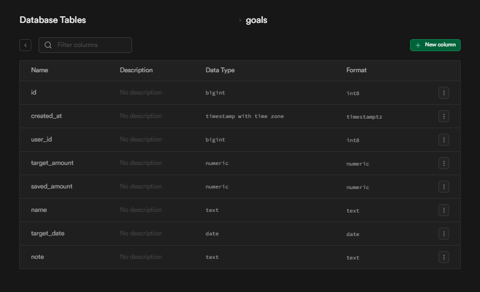
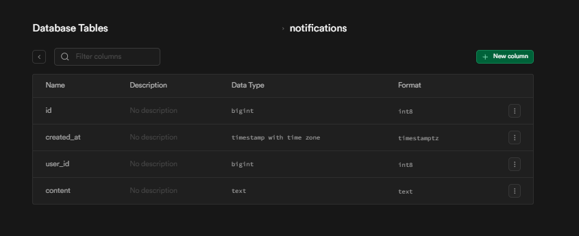

<h1 align="center">Wallet Management</h1>
<h2> Introduction</h2>
As-Salamu Alaikum. Welcome to the official repository of Wallet Management application.
This is our java project aims to track the daily expenses and income of the user to make him/her aware of his current economical state before it's too late.
<h2> Features</h2>
Our application included some beneficial features like: 
 1) Visual representation of total expenses of each category, incomes and current balance  
 2) Track savings for future goals within the target period 
 3) Track lents and debts untill the deadline 
 4) Budget plan for certain category/section within selected period.  
 5) Fixed deposit tracker to track the updated deposited amount till the maturity period 
 6) Notification system integrated to let the user know if he reached on overspent or if the maturity period ended 
 7) Reset password  

<h2> Techs Used</h2>
Frontend: Javafx & scene builder
Database: PostgreSQL on Supabase

Its a serverless application...

<h2> Prerequisites</h2>
<h3>Setup Maven/Jar files</h3>
Resolve all the Maven dependencies of pom.xml file.if fails then a 2nd way is:

Include necessary jar files before running the program:

<h3>Database connection </h3>
Open a new project in Supabase, collect the DB_URL, DB_USER & DB_PASSWORD
and add these variables ina .env file.

Create these 10 tables:

1)

2)

3)

4)

5)

6)

7)

8)

9)

10)

<h3>Reset password </h3>
For enabling reset password feature open a gmail acoount and create a passkey.Then include the APP_ACCOUNT, APP_PASSWORD in same .env file.

<h3>Conclusion </h3>
Run the program, some error may still occur for jar files due to the version related issues as they changes over time. Make sure to include the similar versions for each one otherwise they may cause error.

<h4>HAPPY CODDING!!!</h4>